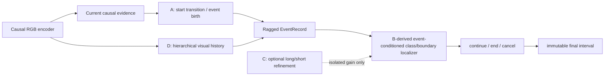

# 当前方向与目标完整报告：Raw-RGB Dynamic Event Memory On-TAD

## 1. 一句话结论

最终目标是一个直接读取原始 RGB 视频、标准全监督、严格因果的 On-TAD 模型：
动作开始一旦在当前视频证据中可观察，模型立即创建一个动态事件并给出临时开始与
类别；动作进行中持续维护同一实例；结束时只关闭该实例并低延时写出唯一、正长度、
不可修改的最终区间。

当前冻结特征实验只是第一阶段机制诊断。它不能代替 raw-RGB 结果，也不能成为论文
最终主张。旧 FIXED/REMATCH 槽位路线已经完成技术验证但性能门失败，准确数字只在
[query pack](research-wiki/query_pack.md) 和原实验记录中维护，本报告不复制第二份
结果源。

## 2. 最终任务边界

### 2.1 必须满足

- 标准 closed-set、fully supervised Online Temporal Action Localization；
- 时刻 `t` 只能读取来源时间不晚于 `t` 的 RGB 帧和历史状态；
- 开始阶段允许发布可撤销的临时开始、类别和事件状态；
- 每个动作实例有独立且稳定的 `event_id`；
- 结束判定必须以该事件自己的开始锚点和历史轨迹为条件；
- 最终输出为 `{start, end, class, score, event_id}`；
- 最终区间满足 `start < end <= source_frame <= emit_frame`；
- 每个事件最多结束一次，最终输出一旦写出不可删除、替换或回改；
- 同时报告视频时间延时、墙钟延时、吞吐、峰值记忆和因果违规。

### 2.2 明确不做

- 不把固定数量的 semantic slot 或 switch 当作最终并发模型；
- 不在动作结束时自由匹配任意过去开始点；
- 不把统一 `0.5` 当作通用科学规则；统一 0.5 只保留为消融；
- 不用未来帧、完整视频回看、offline NMS 或 report split 调参；
- 不把 frozen feature 成功写成 raw-RGB 端到端成功；
- 不把 OnVLLM 扩展与标准 On-TAD 主任务混为一个主 claim。

OnVLLM 只作为可选输出头：它可以描述同一动态事件，但不能取代标准区间，也不能
读取不同的未来证据。

## 3. 当前阶段与已经获得的信息

旧槽位路线已经证明训练、监督、严格因果账本、正长度输出和容量审计链路可以跑通；
同时也暴露两个关键问题：固定容量需要数据集 census 与人工 reserve 才能安全，且合法
结果仍表现为低召回和严重过量发射。因此它现在有三种用途：

1. 技术与评测基础设施；
2. 固定槽位的负基线；
3. 新动态事件路线必须超过的最低参考。

当前新路线处于“设计已落盘，官方基线与实现尚未启动”的阶段。尚不能声称动态事件、
自适应记忆或 raw-RGB 联合训练已经提升性能。

## 4. 为什么需要共同接口，但不改造官方基线

这里需要区分三件完全不同的事。

### 4.1 官方原生基线

ActionSwitch、MATR、HAT/OAT 和 HEM 必须首先在完整、只读的官方仓库中，使用官方
入口、数据形式、checkpoint、解码器和指标运行。原生基线不需要 OpenTAD 接口，
也不允许为了方便而改写。

### 4.2 中立的比较合同

我们需要一个很薄的中立合同，把不同方法的外部输入输出整理成共同审计字段，例如：

```text
input timestamp / feature-or-RGB provenance
provisional event message
final interval
source_frame / emit_frame
latency / causal violations
```

它的目的只是统一数据划分、坐标、指标、因果账本和资源统计。它不能替换官方内部的
target、loss、matching、memory、decoder 或 post-processing。如果转换后的输出不能在
注册容差内复现官方原生输出，该适配失败，该方法只能保留原生比较，不能进入融合。

### 4.3 可写融合实现

真正的 A+B 或 ABD 代码只存在于独立可写工作区和最终干净路线中。OpenTAD 在这里
只是数据、训练、评测和调度容器，不是科学贡献。采用它的理由是复用已经审计过的
严格因果数据读取、训练划分、指标和 Slurm 链路，避免每个融合组合都重新制造一套
不可比较的实验栈。

因此正确顺序是：

```text
官方原生运行 -> 只读 fidelity receipt -> 最小输出转换 -> parity receipt
             -> 独立可写融合实现
```

而不是：

```text
先把官方方法改写成 OpenTAD 版本 -> 再把改写结果当成官方基线
```

## 5. 为什么要融合 A/B/C/D

融合不是为了堆模块，而是因为当前问题可以拆成三个互相连接、但可独立证伪的瓶颈：

1. **什么时候创建动作实例**：需要及时、稳定的开始状态转变检测；
2. **如何维护并结束同一个实例**：需要准确类别与边界，同时避免错误起止配对；
3. **如何保留足够历史而不固定记忆长度**：需要针对动作长短和内容自适应的记忆。

四个 donor 的科学角色不同：

| 方法 | 提供的强项 | 单独使用时与本目标的缺口 |
|---|---|---|
| A ActionSwitch | 即时状态转移、重叠/同类动作、保守状态变化 | 固定 switch 表示；不是 raw-RGB；定位与类别主干不是本项目最终结构 |
| B MATR | 强类别/边界解码、历史起点检索、成熟 On-TAD 基线 | 以当前结束回找过去开始为核心，开始不一定即时发布，也可能发生自由配对 |
| C HAT/OAT | 当前与长历史融合、anchor、online suppression | 历史长度/表示较固定，不维护独立动态事件身份 |
| D HEM | 层级事件构造、合并、动态尺度分配、低延时分析 | 属于 query-conditioned temporal grounding，不直接解决 closed-set 动态实例生命周期 |

### 5.1 每个组合回答的具体问题

- **AB**：A 的即时开始能否与 B 的强定位器协作？如果 AB 不优于 A 和 B，说明
  “即时出生 + 强定位”本身没有互补性。
- **AD**：A 创建的事件能否由 D 式层级记忆长期维护，并摆脱固定 switch/固定窗口？
- **BD**：不改变 B 的 end-centric 生命周期，仅换成层级历史是否已经足够？它用于
  判断收益来自“更好记忆”还是“新生命周期”。
- **BC**：HAT 式长短历史是否比 HEM 更适合 MATR？这是记忆 donor 的直接对照。
- **ABD**：只有 AB、AD 或 BD 至少提供可解释增益时才成立。它把即时事件出生、
  start-conditioned 实例定位和层级自适应历史组成主模型。
- **ABCD**：只检验 C 在 ABD 上是否仍有独立增益；如果没有，删除 C，不能为了模型
  看起来复杂而保留。

主模型并不是把 MATR 的“结束时任意回找开始”原样叠到 ActionSwitch 上。忠实 B arm
保留原设计用于对照；ABD 主 arm 则让 A 创建的 `EventRecord` 成为所有后续类别、持续、
结束和记忆读取的拥有者，B 的定位能力被改造成 event-conditioned localizer。



## 6. 候选创新与不能声称的创新

### 6.1 不能声称

- 状态转移本身新：ActionSwitch 已经覆盖；
- 历史记忆本身新：MATR、HAT 和 HEM 已经覆盖；
- raw video streaming 本身新：E2E-LOAD、StreamFormer 等邻近工作已经覆盖；
- persistent query 本身新：tracking/online VIS 已经覆盖；
- 把四个模型连接起来就自然产生创新。

### 6.2 需要实验才能存活的候选贡献

1. 在标准 On-TAD 中，由可观察开始状态即时创建无固定语义容量的动态事件；
2. 以事件自己的开始锚点和历史轨迹约束结束，降低同类重叠时的错误关联；
3. 把 active-event memory 与可压缩 visual-history memory 分离，并学习样本条件的有效
   记忆跨度；
4. 把上述实例机制与严格因果 raw-RGB 视觉适配放入同一训练图；
5. 在 accuracy-delay-memory 三维 Pareto 上超过每个直接父方法，而不是只提高一个
   mAP 数字或通过少发射获得表面收益。

如果最新工作已经完整实现第 1—4 项，或者这些项可以由两篇现有论文直接、无新技术
困难地组合得到，路线必须缩窄或停止。这正是下一轮 Pro 审判的首要问题。

## 7. 可发表论文的条件性内容

论文主线应保持单一：

> 原始 RGB 的严格因果 On-TAD 中，动作实例应在开始可观察时出生，并以自有身份和
> 自适应历史一直维护到结束，而不是在固定槽位中竞争或等到结束再自由寻找开始。

主方法是 raw-RGB ABD；C 与 OnVLLM 都是可选扩展。论文至少需要：

- 官方 A/B/C/D 原生复现及适配 parity；
- feature-matched A/B/D、AB/AD/BD/ABD 因果消融；
- raw-RGB frozen-backbone、adapter、joint 三阶对照；
- 与 MATR、ActionSwitch、HAT/OAT、HEM adaptation、SimOn 等标准强基线比较；
- THUMOS14 主结果和至少一个长上下文/密集重叠外部数据集；
- 同类重叠、异类重叠、相邻动作、超长动作和交叉结束顺序分层；
- mAP/F1/Recall、prediction/GT、错误关联率、开始/结束延时、峰值记忆、FPS；
- 多种子配对不确定性、一次性 report 评测和零因果违规收据。

## 8. 并行实验路线与信息增益

| 并行线 | 首要产物 | 证明或否定 | 获得的信息 |
|---|---|---|---|
| 官方只读 A/B/C/D | native fidelity receipts | 是否真正复现原方法 | 排除错误基线与代码误读 |
| 可写 A/B/C/D 副本 | adapter parity receipts | 中立合同是否改变语义 | 决定哪些模块可安全融合 |
| AB/AD/BD/BC 数组 | 父子 matched-feature 结果 | 组件是否互补 | 定位收益来源与负相互作用 |
| 动态事件正确性 | overlap/association/ledger tests | 是否解决槽位和错配 | 获得机制正确性边界 |
| raw-RGB 基础设施 | causal/gradient/latency receipts | 是否真的读取并训练 RGB | 排除 cached-feature 冒充 E2E |
| ABD 主模型 | feature 与 raw-RGB 结果 | 三个瓶颈是否联合改善 | 决定论文主方法是否存活 |
| ABCD/OnVLLM | 可选增量结果 | 附加复杂度是否值得 | 无增益则删除，避免拖慢主线 |
| calibration/multi-seed | 冻结选择与统计收据 | 增益是否稳定 | 决定能否形成论文 claim |

昂贵 raw-RGB joint job 只等待两个条件：真实 RGB 路径通过技术 smoke；feature-level
ABD 至少显示机制存活。其他官方复现、pairwise fusion、正确性测试和 RGB 基础设施
同时进行，不采用逐个方法串行等待的低效率流程。

## 9. 预期信息增益与停止条件

- A 强、AB 不增益：B 定位器与即时事件出生冲突，重构 localizer 或停止 AB；
- D 强、AD 不增益：层级记忆不能维护 ActionSwitch 式事件，重新检查事件—记忆接口；
- BD≈B、AD>A：收益主要来自事件生命周期而不是通用记忆；
- BD>B、AD≈A：收益主要来自记忆结构，动态生命周期创新较弱；
- ABD 不超过所有直接父模型：完整路线不成立，不能用 raw-RGB 预算挽救；
- feature ABD 有效、raw-RGB 无增益：问题在视觉适配或训练预算，不等于事件机制失败；
- raw-RGB ABD 在精度、延时或记忆上形成 Pareto 改善：进入多种子和论文主结果；
- 任意因果、错配、不可变或正长度违规：技术无效，不能报告定位性能。

## 10. 当前下一步

1. 用独立 Pro 审查先进行最新竞品和组合显然性审判；
2. 若 verdict 为 GO/REVISE 且存在可保留 claim，建立 A/B/C/D 只读参考目录；
3. 同时创建可写副本、融合工作区和 raw-RGB 基础设施分支；
4. 先得到 fidelity/parity/contract receipts，再解释任何融合性能；
5. 按依赖图自动提交 pairwise、ABD、raw-RGB 和多种子作业。

完整架构规范见
[raw-RGB dynamic event memory design](docs/superpowers/specs/2026-07-22-raw-rgb-dynamic-event-memory-ontal-design.md)，
并行实验图见
[Wiki design record](research-wiki/experiments/ontad-rgb-dynamic-event-memory-design-20260722.md)。
