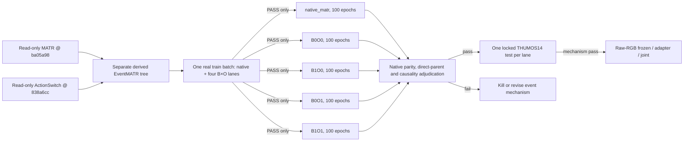

# Official-MATR-Parent Event Ownership Factorial — 2026-07-22

## Decision

The former OpenTAD FIXED/REMATCH training recipe is retired for the new model.
Its 12 epochs, seed 705, SigLIP2 stride-8 cache, batch size one, AdamW `2e-4`
and six-entry capacity guard are historical evidence only. No new-model job may
inherit them, and the uncommitted OpenTAD `K×O` launcher was not deployed.

The single executable parent is the official ECCV 2024 MATR implementation:

- upstream: `https://github.com/skhcjh231/MATR_codebase`;
- exact upstream SHA: `ba05a98d451b3541c1a5377026f17dc1102fa217`;
- untouched reference: read-only;
- writable derived repository:
  `E:/DeskTop/TAD/OpenTAD_OnlineTADClean_20260702/_codex_worktrees/matr-event-memory-official-parent`;
- local import commit: `33276e139b97597d17a3ebc35eddb118acbde0dd`.
- locally verified implementation commit:
  `64d7f78dd8ed1436bac08ebfb03b51c90142129b`;
- implementation Git tree: `bc6f5057e954ed448dcb5173489eba7c4dcba27d`;
- frozen manifest SHA-256:
  `B6D3B51A14253E66A9D5C110F5B08FDAF96C31EB48FB2DF9A3B57CD5E61FB1C9`.

The derived repository is a separate writable tree. The official reference is
not edited. A later implementation commit is recorded below after the complete
local contract suite passes; neither commit is a performance result.

ActionSwitch is a mechanism donor and native comparison, not the parent:

- upstream: `https://github.com/musicalOffering/ActionSwitch-release`;
- exact SHA: `838a6ccbd8f2cce414688ff2843380d712aa7b89`;
- borrowed idea: class-agnostic state transitions for concurrent starts;
- its released eight-epoch state-classification recipe is not substituted for
  the MATR localization recipe.

HAT SHA `a38dad6a266f49546be7b19e5cd1918bb1ba1e34` and OnVTG/HEM SHA
`4f629e8959129d80ac1aa80e01ac351782846841` remain read-only later-stage
references. HEM is OnVTG rather than closed-set On-TAD and cannot define the
main experiment schedule.

## Why MATR Is the Parent

MATR directly solves standard On-TAD on THUMOS14 and MUSES, predicts complete
action intervals, and already separates current-segment end localization from
past-memory start retrieval. The missing behavior is exactly our target delta:
MATR uses fresh per-prefix instance queries and normally discovers an instance
around its end, whereas the proposed model should create a provisional event at
prefix-visible start evidence, preserve its owner identity, update its class and
boundaries, then close it with owner-conditioned end evidence.

## Official Setting That Must Be Preserved

The native parity run and all four matched arms use the official THUMOS14 code
defaults unless the changed factor requires otherwise:

- official supplied RGB+flow feature pickles, `4096` dimensions;
- streaming segment length `64`;
- `10` decoder queries;
- `7` historical memory segments, `gap2` sampling;
- hidden dimension `1024`, FFN `2048`, three encoder and five decoder layers;
- batch size `64`, one parallel video stream;
- `100` epochs, random seed `52`;
- Adam, learning rate from `1e-8` to `1e-5`, cosine warm-up/restarts with
  `T_up=3`, `T_0=10`, `gamma=0.9`, weight decay `1e-4`;
- focal classification, official loss weights, class threshold `0.1`, memory
  flag threshold `0.5`, online-order NMS threshold `0.3`;
- THUMOS14 mAP at tIoU `0.3:0.1:0.7`.

The official code's post-hoc `online_nms` is allowed for native parity. For the
strict-causal matched study it must be replayed incrementally in generation-time
order and proven event-equivalent; no future proposal may alter an earlier
commit. This is a task-contract adaptation applied identically to every arm,
not a claimed model improvement.

## New Model: EventMATR (Provisional Name)

The model retains the official MATR encoder, memory queue, two decoders and
prediction heads. Exact upstream MATR remains a separate `native_matr` lane.
Every cell below is an eventized model with the same transition head, owner
decoder and loss schema, so the factorial changes only two controlled factors:

- `B`: when a prefix-visible action-start transition is detected;
- `O`: whether the resulting event keeps an owner query until cancel/end.

```text
native_matr = exact official architecture/labels/losses, kept outside B×O
B0O0 = delayed MATR-style event birth + fresh end-time rematching
B1O0 = immediate transition event birth + fresh end-time rematching
B0O1 = delayed MATR-style event birth + sticky persistent owner
B1O1 = immediate transition event birth + sticky persistent owner
```

`B1O1` creates a ragged event record at the first causal start transition. Each
record contains its owner query, start distribution, class belief, alive belief,
and causal memory view. It is updated from current and past features only. Its
end decoder is conditioned on the owner query; decoded `end_time` is separate
from later immutable `emit_time`. There is no manually selected semantic slot
count. A physical safety ceiling may only fail closed and invalidate the run;
it may not silently truncate events.

START/ALIVE/END/BACKGROUND are learned by one competitive four-state head.
Formal START and END decisions use the winning state, not a universal sigmoid
`0.5` threshold. For an active owner, BACKGROUND is a learned CANCEL: it removes
the provisional event without emitting an interval and records the reason and
frame. The official MATR `flag_threshold=0.5` is preserved only inside the
native MATR memory-admission path; it is not the EventMATR birth/end rule.

The official ten queries remain per-prefix prediction bandwidth, not a fixed
bank of ten persistent event slots. Runtime event records are ragged and have
no semantic count limit. Any optional physical resource ceiling is an explicit
fail-closed systems guard and is not a model prior.

Training may use full interval annotations to construct prefix-visible birth,
alive and first-crossing end targets. Runtime state may never contain GT IDs or
future endpoints. Same-class overlap uses permutation-aware training until a
birth is owned, then sticky ownership prevents owner swaps.

## Scientific Comparisons

The primary decision is not whether the candidate exceeds the old `1.614` mAP
negative baseline. It must:

1. reproduce native MATR before claiming an improvement;
2. beat both direct parents `B1O0` and `B0O1` under the official 100-epoch
   setting;
3. improve mAP/Recall and reduce wrong-start, owner-swap, fragmentation and
   duplicate-close errors on overlap and same-class strata;
4. not obtain the gain through later emission, future access, more visual
   features or unmatched post-processing;
5. retain zero causal, positive-length, immutable-output and double-close
   violations.

Feature results establish the event mechanism only. The final paper still
requires original-RGB strict-causal training. After this factorial passes, the
official MATR input projection is replaced by one causal visual backbone under
frozen/adaptor/joint comparisons while the successful event mechanism remains
fixed.

## Execution DAG



The native lane and four eventized arms are released in parallel only after a
single-GPU real official training-batch smoke proves forward, backward, one
Adam step, finite losses/gradients, transition/owner gradients and strict
checkpoint reload for all five lanes. The smoke and every worker must match the
same clean Git commit, Git tree and frozen-manifest SHA-256.

Training uses the complete official THUMOS14 validation/train set. It performs
no calibration split, constructs no test loader, does not inspect test metrics
and keeps only `terminal_epoch100.pth`. After all training and causal contracts
pass, each frozen terminal model is permitted one separately submitted locked
THUMOS14 test evaluation. This restores the official setting and prevents
checkpoint selection on the test set.

## Implementation and Current Gate

The derived implementation now includes native isolation, all four matched
event lanes, ragged causal event memory, owner-conditioned decoding, four-state
supervision, learned cancellation, end/emit separation, immutable ledgers,
positive-length intervals and padding/EOS/true-duration guards. The dangerous
hand rules that merged events with the same start or cosine similarity `>0.95`
were removed because they can collapse legitimate same-time same-class
instances.

### Real official five-lane smoke passed — 2026-07-26

Slurm `1190635` completed with `0:0` on `g0013` in `00:02:08`. Its
`eventmatr_real_smoke.json` is `PASS`, binds the corrected isolated source
commit `ba3f153c18892859a12ff76f9c6afa0c0ab5460e`, tree
`fe21d82a2e1fc3f025853d43ca5fe53b17c5b14c`, and the frozen official-data
manifest `b6d3b51a14253e66a9d5c110f5b08fdaf96c31eb48fb2df9a3b57cd5e61fb1c9`.
All five lanes used one true official training batch of shape `64×64×4096`,
performed finite forward/backward/Adam steps, produced the required event and
owner gradients, and passed strict checkpoint reload. `test_access=false`.
The native/B0O0/B1O0/B0O1/B1O1 smoke losses were respectively `3.1775`,
`11.3117`, `11.6944`, `15.2711`, and `12.8936`; these single-batch values are
technical diagnostics only, not comparative performance evidence.

This clears only the execution gate for five independent, exact-setting,
100-epoch matched-training lanes. Test data remains unmounted during training;
no mAP, Recall, or model-ranking claim is authorized until all terminal
checkpoints complete and the separately locked final evaluation gate runs.

The first formal submissions (`1190688`–`1190692`) exited before Python/model
startup because Slurm workers did not inherit `MATR_ENV_ACTIVATE`. Their logs
contain only that missing activation diagnostic, so they are classified as an
environment-injection failure. The verified N16 activation path was supplied
explicitly and the unchanged five lanes were re-released as native `1190693`,
B0O0 `1190694`, B1O0 `1190695`, B0O1 `1190696`, and B1O1 `1190697`, under
`formal100_seed52_20260726_065156_ba3f153`. The completed smoke was inspected
before release; the scheduler's refusal to accept an `afterok` reference to an
already completed job was also scheduling-only and no dependency bypass changed
the source/data/receipt gate.

Local verification on 2026-07-23 is `62 passed`; the official-protocol checker,
Python compilation, all Git-Bash launch scripts and `git diff --check` pass.
These are implementation and contract results only. The real-data smoke and
formal 100-epoch DAG have not run because the exact official MATR THUMOS14
feature/annotation files are not present on the configured N16R4 storage and
the remote node cannot currently fetch the Google Drive release. Substituting
SigLIP2/OpenTAD features would destroy official-parent parity, so the launcher
fails closed instead.

The main scientific risk before performance evidence is the train/runtime
distribution gap between dense per-query owner prototypes used for supervision
and ragged persistent owner trajectories used online. Cancellation rate,
missed-start rate, owner swaps and overlap-stratified results must therefore be
reported; the local tests do not establish model quality.

### N16R4 official-data staging update — 2026-07-23

The user provided an N16 academic egress route for the official MATR Google
Drive release. The controlled invocation exports `http_proxy` and
`https_proxy` only to the download process, through the N16 endpoint
`10.244.6.36:3128`; its credential is externally injected and deliberately
not stored in this repository, the Wiki, terminal logs, or Git history. A
requests probe through that route reached the official Drive folder with HTTP
200. The first `gdown` run then exposed a non-scientific staging issue:
`gdown` tried to create its cookie cache under the quota-limited login home.
The downloader was repaired to place `HOME`/`XDG_CACHE_HOME` under the project
data root, retaining no credential, and restarted through the same academic
route.

The official folder contains `thumos_dataset.zip` (and an unrelated official
checkpoint), rather than the three expected files at its top level. The
stager now verifies the archive with `unzip -tq`, extracts it under the data
root, locates `thumos_all_feature_val_V3.pickle`,
`thumos_all_feature_test_V3.pickle`, and `thumos14_v2.json`, performs format
checks, and writes a SHA-256 source manifest before creating
`OFFICIAL_MATR_DATA_READY`. No smoke or training job may be submitted before
that sentinel exists. This is a source-access/cache repair only, not a model
or performance result.

At the third hourly monitor, the resumable direct official archive had reached `1,041/11,622` 512KB ranges (about 533MB), a gain of 499 complete ranges; its detached N16 session remained alive. The initial high-concurrency transfer exposed proxy disconnects, so the active downloader deliberately uses a single conservative range worker and a durable completion bitmap. This retains every completed range and classifies the issue as egress stability, not data or model failure. The three staged files, source manifest and `OFFICIAL_MATR_DATA_READY` remain absent, therefore the real-data five-lane smoke has not been submitted.

### N16R4 official-data completion and smoke release — 2026-07-26

The official archive completed `11,622/11,622` ranges. Independent verification
passed ZIP integrity, 200 train/val feature videos, 213 locked-test feature videos,
and 412 annotation videos; every sampled feature record has both `rgb` and `flow`.
Frozen SHA-256 values are `5ee13ac9…e2e1c57` (ZIP), `d4660b31…5d45ac9b`
(train/val features), and `7c493d80…f0ad4993` (locked-test features). The
stager's final format expression had a bracket syntax defect after its archive
check; independent validation repaired only that staging step before writing the
manifest and readiness sentinel. This is not a data or model failure.

The first N16 submit was rejected pre-queue because its per-GPU memory policy
disallows the redundant script-level `--mem=32G` request. Source, data, and model
were unchanged. Resubmission removes only that scheduler directive at submit time
and uses N16's default single-GPU memory allocation: Slurm smoke `1190483`, run
`real_smoke_seed52_20260726_035205`. It runs native MATR plus B0O0/B1O0/B0O1/B1O1
on one true batch of 64 train prefixes, with test access absent. It is pending;
there is no performance or model-validity conclusion yet.

### Smoke-contract recovery — 2026-07-26

Smoke `1190483` reached `g0053` but stopped in `00:00:51` before the real-data
program: the worker inherited `MATR_SOURCE_*`, and a unit test that deliberately
creates an unrelated temporary Git repository accidentally treated those ambient
values as its expected identity. The remote suite therefore reported `61 passed,
1 failed`; no forward pass, optimizer step, feature batch, gradient, checkpoint,
or test access occurred. This is a verifier-isolation defect, not a model or data
failure.

Derived commit `ba3f153c18892859a12ff76f9c6afa0c0ab5460e`
(tree `fe21d82a2e1fc3f025853d43ca5fe53b17c5b14c`) makes the verifier accept only
explicit `--expected-*` arguments and adds a regression test for ambient-launch
identity. The new remote isolated worktree passed the official protocol and all
`63` tests, then was cleaned of generated `__pycache__` directories before
identity-gated execution. Corrected real five-lane smoke `1190605` is submitted
at `real_smoke_seed52_20260726_044939_ba3f153`, currently pending. Formal 100-epoch
lanes remain unsubmitted.

Smoke `1190605` then reached `g0005`, completed the source-identity and all
`63` protocol tests, and failed only when importing the official MATR transformer:
the fixed N16 OpenTAD environment lacked `typeguard==4.1.5`, an exact dependency
listed in the official `requirements.txt`. No real model batch, gradient, optimizer
step, checkpoint, test access, or performance result followed. The missing package
was installed from the configured academic PyPI mirror and import-verified; this is
an environment repair, not a source or model modification. Re-submitted smoke
`1190635` uses the unchanged `ba3f153` source/data/manifest and is pending. Formal
100-epoch lanes remain blocked on a valid five-lane receipt.
