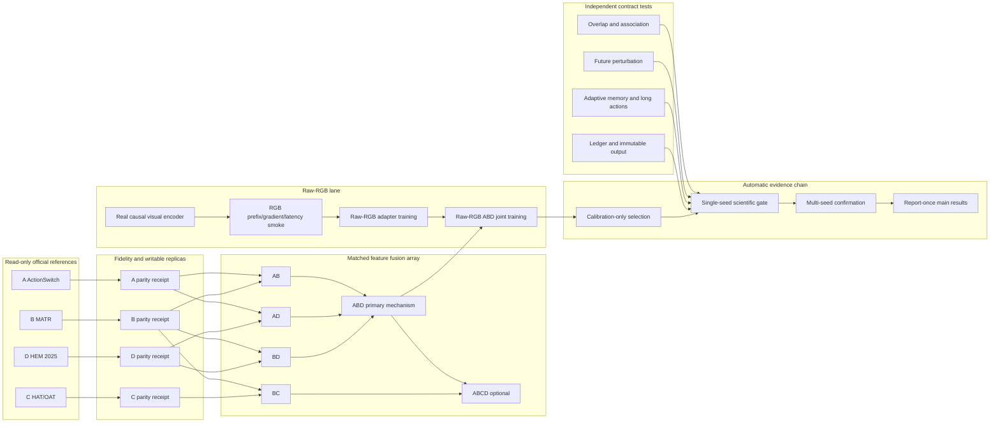

# Raw-RGB Dynamic Event Memory Design Freeze — 2026-07-22

## Purpose

Record the transition from the technically valid but low-performing fixed-slot
feature baseline to a raw-RGB, slot-free dynamic-event method built from faithful
official On-TAD and event-memory donors.

## Reproducible Starting Point

- branch: `codex/ontad-rgb-event-memory`;
- clean design workspace:
  `E:/DeskTop/TAD/OpenTAD_OnlineTADClean_20260702/_codex_worktrees/ontad-rgb-event-memory-clean`;
- starting commit: `36081a5` from `codex/ontad-science-fixed-rematch`;
- full specification:
  `docs/superpowers/specs/2026-07-22-raw-rgb-dynamic-event-memory-ontal-design.md`.

## Frozen Design Decisions

1. The mandatory final input is original RGB, not cached features.
2. Starts are detected immediately from causal evidence and create dynamic event
   records; class beliefs may refine while the event remains provisional/active.
3. Ends are conditioned on the owning event trajectory, preventing unconstrained
   start/end pairing.
4. Active events have no manually chosen semantic slot count. Learned
   hierarchical visual memory adapts its effective span to sample content and
   action duration.
5. A/B/C/D official repositories remain complete and read-only. Writable donor
   replicas and all A+B family fusion trees are isolated from them.
6. Every port records exact upstream SHA, source path, license, diff hash, and
   parity evidence. Official data, target, loss, assignment, decoder, metric,
   optimizer, and schedule paths must be reviewed before changing a donor.
   Guarded official runs write all outputs outside the source tree and fail if
   pre/post HEAD, tree hash, status, or file inventory changes.
7. Thresholds are calibration policies rather than a universal 0.5 rule.
8. Structured On-TAD output is mandatory; OnVLLM language output is optional.

## Planned Parallel Lanes

- acquire and fidelity-test A/B/C/D read-only references;
- build writable single-donor adapters and the fusion matrix;
- replace the raw-RGB visual stub and verify causal gradients/latency;
- run overlap, association, long-action, future-perturbation, and memory tests;
- launch calibration and multi-seed/report jobs through scheduler dependencies
  after their registered parents pass.

## Dependency-Aware Parallel Experiment Graph

The graph permits A/B/C/D acquisition, parity work, raw-RGB infrastructure, and
contract tests to progress concurrently. Only expensive joint raw-RGB ABD
training waits for both a working RGB lane and the feature-level ABD mechanism
gate. ABCD is optional and cannot delay the primary ABD path.

No official repository has been modified, and no fusion implementation or new
training run is claimed at this design checkpoint.
